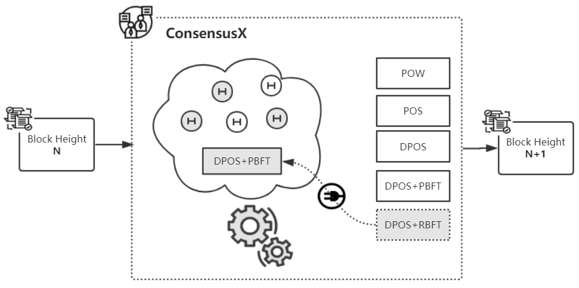

# CroxEngine 

## Background
---

- Once a consensus algorithm has to be changed during blockchain operation, in order to adopt a different business scenario, the ConsensusX can immediately switch the original algorithm into others. In the case that DPoS was chosen, the Dynamic Node mechanism could also help with the node's quantity adjustment. This fast and easy pluggability greatly reduces the risk of false algorithm selection in the early stage, and it also provides an efficient, flexible and low-cost blockchain solution for enterprises.  

## FrameWork Diagram
---  

