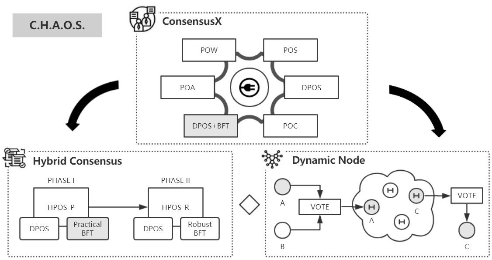

# C.H.A.O.S. Introduction

The Cross-Hybrid Automated Operating System, as known as C.H.A.O.S., contains three core modules: the hybrid consensus - HPoS, Dynamic Node, and the cross consensus engine - Consensus X. The system adopts the benefits of the multi-consensus algorithm, enhances the scalability and adaptivity of the network with the dynamic node, and supports the pluggability and switchability of cross consensus network operations.

Includes three core modules: 
  - HPoS 
  - Dynamic Node  
  - ConsensusX.  

## Framework Diagram  

